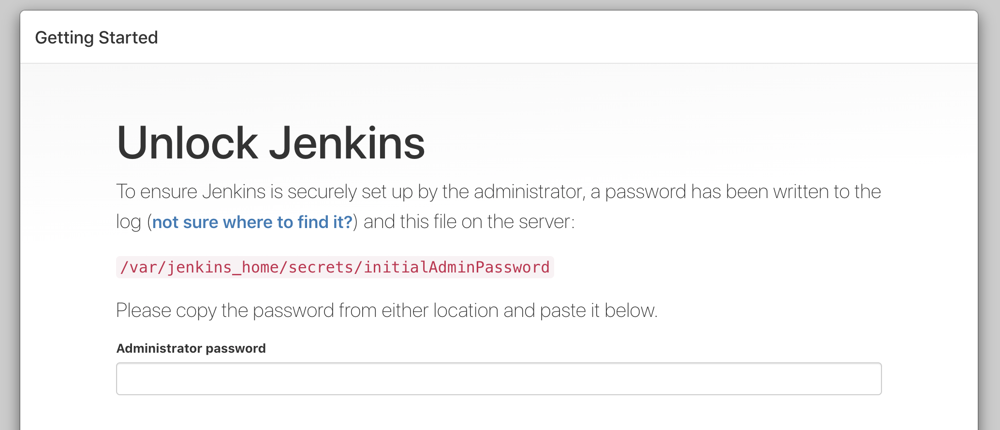
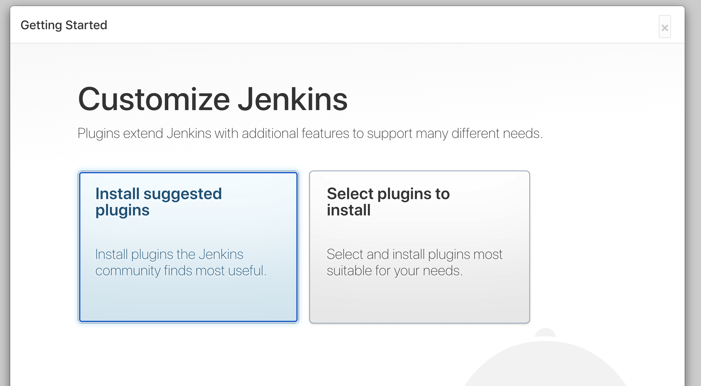
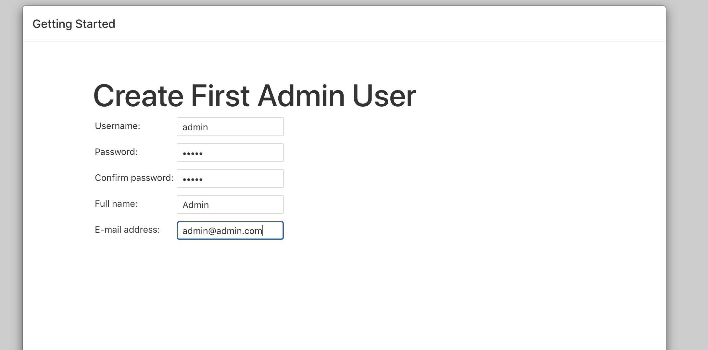
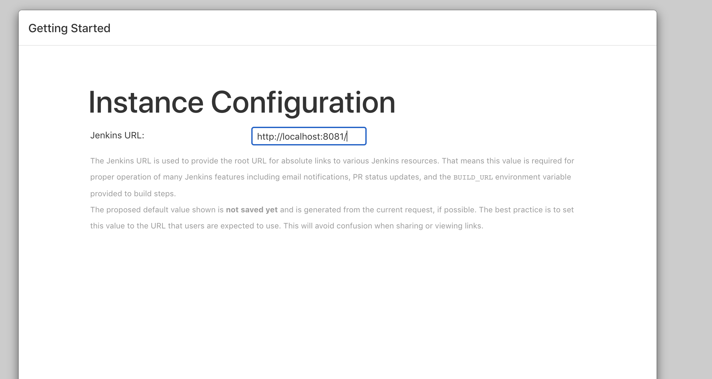
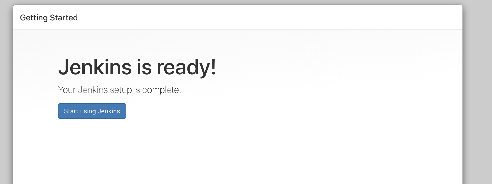

# DevOps
Make sure you have the following software installed on your local machine, before proceeding.

Requirements:

1. VirtualBox - [Installation Guide](https://www.virtualbox.org/manual/ch02.html)
2. Vagrant - [Installation Guide](https://www.vagrantup.com/docs/installation)

Once you have installed vagrant open a terminal or console and type the following command:

```bash
$ vagrant plugin install vagrant-vbguest
```

### Clone the repository to local

Clone the repository to your local environment

```bash
$ git clone https://github.com/rodolfocamposGL/DEVOPS101.git
$ cd DEVOPS101
```

### Start up the environment

We need to start and provision the environment with the following software:

* Docker Community Edition
* Jenkins (Running inside a Docker Container)
* microk8s (Kubernetes environment for Ubuntu)

Type the following command on a terminal or console window:

```bash
$ vagrant up
```

To access Jenkins visit http://localhost:8081. You will need to configure Jenkins for the first time. Please refer to section "Jenkins Configuration".

### Access the environment

In case is require to login to the machine to perform any operation, the virtual machine can be access using ssh.

Type the following command on a terminal or console window:

```bash
$ vagrant ssh
```

### Stop the environment 

Type the following command on a terminal or console window:


```bash
$ vagrant stop
```

### Delete the environment

Type the following command on a terminal or console window:

```bash
$ vagrant destroy -f
```

## Jenkins Configuration

To configure Jenkins server for the first time we need to get the password from the **/var/jenkins_home/secrets/initialAdminPassword** file.
This will require to access the virtual machine to extract the information.

Type the following command on a terminal or console window:

```bash
$ vagrant ssh
$ sudo docker exec cat /var/jenkins_home/secrets/initialAdminPassword
```

Open your browser and navigate to http://localhost:8081 add the secret key and click on "Continue"



Click on **Install suggested plugins**, this could take a while.



Create the admin user and click on "Save and continue"



Confirm the Jenkins server URL and click on "Save and Finish"



Click on Start using Jenkins



## Kubernetes Configuration (microk8s)

### Integrated Commands


* **microk8s.status**: Provides an overview of the MicroK8s state (running / not running) as well as the set of enabled addons
* **microk8s.enable**: Enables an addon
* **microk8s.disable**: Disables an addon
* **microk8s.kubectl**: Interact with kubernetes
* **microk8s.config**: Shows the kubernetes config file
* **microk8s.istioctl**: Interact with the istio services; needs the istio addon to be enabled
* **microk8s.inspect**: Performs a quick inspection of the MicroK8s installation
* **microk8s.reset**: Resets the infrastructure to a clean state
* **microk8s.stop**: Stops all kubernetes services
* **microk8s.start**: Starts MicroK8s after it is being stopped


### kubectl Cheat sheet

[kubectl Cheat Sheet](https://kubernetes.io/docs/reference/kubectl/cheatsheet/)

## Docker Example

```
$ sudo docker ps
$ sudo docker images
$ cd /demo
$ sudo docker build . -t demo/nginx
$ sudo docker run -d demo/nginx
$ sudo docker ps
$ sudo docker kill <CONTAINER ID>
```

## Kubernetes Example

```
$ cd /demo
$ sudo microk8s.kubectl get nodes
$ sudo microk8s.kubectl apply -f nginx-deployment.yaml
$ sudo microk8s.kubectl rollout status deployment nginx-deployment
$ sudo microk8s.kubectl get deployments
$ sudo microk8s.kubectl get rs,pods
$ sudo microk8s.kubectl delete deployment nginx-deployment
```